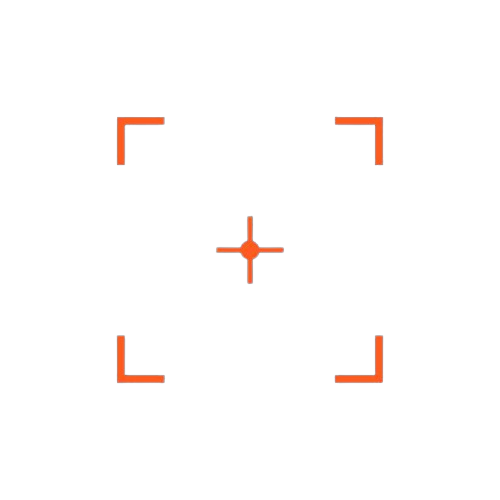

  

<h1 align="center">Genauix</h1>

  <strong>Precision Engineering Studio</strong> 
  Websites · SaaS · Research Infrastructure

  <a href="https://genauix.com">genauix.com</a> ·
  <a href="mailto:Genauix@proton.me">Genauix@proton.me</a>

---

We build software for institutions that demand accuracy — research platforms, custom SaaS, and marketing sites shipped in weeks, not months.

### What we do

- **Research & Institutions SaaS** — Grant tracking, publication analytics, department dashboards, compliance-ready exports
- **Custom SaaS** — 0→1 product builds from architecture to production
- **Websites** — Next.js, hand-coded motion, Lighthouse 95+
- **System Integration** — SSO, LMS connectors, grant-system APIs, compliance pipelines

### Built with

Next.js 16 · TypeScript · Tailwind CSS v4 · Framer Motion · Spline 3D · Recharts · Geist

---

  © 2026 Genauix. Precision engineering.

